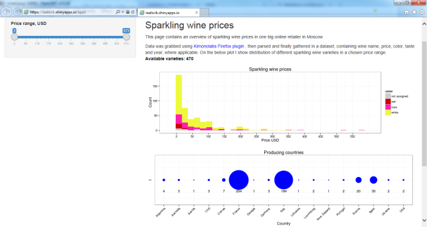

---
title       : Sparkling wine variety
subtitle    : in one online shop in Moscow
author      : Realsvik
job         : 
framework   : io2012        # {io2012, html5slides, shower, dzslides, ...}
highlighter : highlight.js  # {highlight.js, prettify, highlight}
hitheme     : tomorrow      # 
widgets     : []            # {mathjax, quiz, bootstrap}
mode        : selfcontained # {standalone, draft}
knit        : slidify::knit2slides
--- 

## Sparkling wine variety overview
```{r echo=FALSE}
wineDataDF2312<-read.csv("assets/data/wineStyleData2312.csv", stringsAsFactors = FALSE, header = TRUE, sep=";", quote = "",)
```

With this course project I analysed available variety of sparkling wines in one of Moscow online shops. I chose to do so, because it is a suitable topic for Christmas and New Year season. 

As a result, I found out, that price range was as wide as from `r min(wineDataDF2312$usdPrice)` to `r max(wineDataDF2312$usdPrice)` USD, with the majority of bottles coming from France and Italy.

My application allows to see, how many bottles is available for certain price range, in which color, and the contries of origin.

To build the app, I took the following steps:

1. Grab data, using Kimonolabs tools from https://www.kimonolabs.com/
2. Trasnlated the data, so everyone can understand it
3. Cleaned and transformed data for analysis
4. Created the plots

--- .eightyfive


## Getting and cleansing data

Kimono plugin delivers data in json format, so I needed to parse it, using rjson package.
```{r results='hide', , echo=FALSE}
set.seed(7777)
library(rjson)
library(dplyr)
json_file <- "assets/data/winestylespark2.json"
json_data <- fromJSON(file=json_file)
grabInfo<-function(var){
  print(paste("Variable", var, sep=" "))  
  sapply(json_data$results$collection, function(x) returnData(x, var)) 
}
grabInfoNames<-function(var){
  sapply(json_data$results$collection, function(x) returnData(x, var)) 
}
returnData<-function(x, var){
  if(!is.null(x[[var]])){
    return(x[[var]])
  }else{
    return(NA)
  }
}
wineProps<-c(2:5)
wineDataDF<-data.frame(sapply(wineProps, grabInfo), stringsAsFactors=FALSE)
urls<-sapply(json_data$results$collection, function(x) x$property1$href)
names<-sapply(json_data$results$collection, function(x) x$property1$text)
tmpDF<-data.frame(name=names, stringsAsFactors=FALSE)
wineDataDF<-cbind(tmpDF, wineDataDF)
tmpDF<-data.frame(url=urls, stringsAsFactors=FALSE)
wineDataDF<-cbind(tmpDF, wineDataDF)
names(wineDataDF)<-c("url", "name", "country", "price", "color", "taste")
```
<pre class="innerCode">
set.seed(7777)
library(rjson)
library(dplyr)
json_file <- "assets/data/winestylespark2.json"
json_data <- fromJSON(file=json_file)
grabInfo<-function(var){
  print(paste("Variable", var, sep=" "))  
  sapply(json_data$results$collection, function(x) returnData(x, var)) 
}
grabInfoNames<-function(var){
  sapply(json_data$results$collection, function(x) returnData(x, var)) 
}
returnData<-function(x, var){
  if(!is.null(x[[var]])){
    return(x[[var]])
  }else{
    return(NA)
  }
}
wineProps<-c(2:5)
wineDataDF<-data.frame(sapply(wineProps, grabInfo), stringsAsFactors=FALSE)
urls<-sapply(json_data$results$collection, function(x) x$property1$href)
names<-sapply(json_data$results$collection, function(x) x$property1$text)
tmpDF<-data.frame(name=names, stringsAsFactors=FALSE)
wineDataDF<-cbind(tmpDF, wineDataDF)
tmpDF<-data.frame(url=urls, stringsAsFactors=FALSE)
wineDataDF<-cbind(tmpDF, wineDataDF)
names(wineDataDF)<-c("url", "name", "country", "price", "color", "taste")
</pre>


Next step was to translate Russian words in English, extract prices, convert them to USD and extract years, where applicable. Code for this can be obtained from slidify files, posted on github at 

```{r results='hide', echo=FALSE, message=FALSE, warning=FALSE}
#translate contries
levels(as.factor(wineDataDF$country))
tmpcol<-gsub("Регион:\n", "", wineDataDF$country)

tmpcol<-gsub("Австралия", "Australia", tmpcol)
tmpcol<-gsub("Австрия", "Austria", tmpcol)
tmpcol<-gsub("Аргентина", "Argentina", tmpcol)
tmpcol<-gsub("Венгрия", "Hungary", tmpcol)

tmpcol<-gsub("Германия", "Germany", tmpcol)
tmpcol<-gsub("Грузия", "Georgia", tmpcol)
tmpcol<-gsub("Испания", "Spain", tmpcol)
tmpcol<-gsub("Италия", "Italy", tmpcol)

tmpcol<-gsub("Крым", "Crimea", tmpcol)
tmpcol<-gsub("Литва", "Lithuania", tmpcol)
tmpcol<-gsub("Люксембург", "Luxemburg", tmpcol)
tmpcol<-gsub("Новая Зеландия", "New Zealand", tmpcol)

tmpcol<-gsub("Португалия", "Portugal", tmpcol)
tmpcol<-gsub("Россия", "Russia", tmpcol)
tmpcol<-gsub("США", "USA", tmpcol)
tmpcol<-gsub("Украина", "Ukraine", tmpcol)

tmpcol<-gsub("Франция", "France", tmpcol)
tmpcol<-gsub("Чехия", "Czech Republic", tmpcol)
tmpcol<-gsub("Чили", "Chili", tmpcol)

wineDataDF$country<-tmpcol
#clean price
tmpcol<-wineDataDF$price
tmpcol<-gsub("\\*", "", tmpcol)
pricePos<-regexpr("((\\d+\\s){1,2}руб\\.)$", tmpcol)
tmpcol<-substring(tmpcol, pricePos)
tmpcol<-gsub(" руб.", "", tmpcol)
tmpcol<-gsub("\\s", "", tmpcol)

wineDataDF$price<-tmpcol
wineDataDF$price<-as.numeric(wineDataDF$price)

#translate taste
levels(as.factor(wineDataDF$taste))
tmpcol<-wineDataDF$taste

tmpcol<-gsub("Полусладкое", "semi sweet", tmpcol)
tmpcol<-gsub("Полусухое", "semi dry", tmpcol)
tmpcol<-gsub("Сладкое", "sweet", tmpcol)
tmpcol<-gsub("Сухое", "dry", tmpcol)
tmpcol<-gsub("^$", "not assigned", tmpcol)
wineDataDF$taste<-tmpcol

#translate color
levels(as.factor(wineDataDF$taste))
tmpcol<-wineDataDF$color

tmpcol<-gsub("Игристое-", "", tmpcol)
tmpcol<-gsub("Шампанское-", "", tmpcol)
tmpcol<-gsub("Шампанское", "white", tmpcol)
tmpcol<-gsub("Брют", "", tmpcol)
tmpcol<-gsub("красное", "red", tmpcol)
tmpcol<-gsub("белое", "white", tmpcol)
tmpcol<-gsub("розовое", "rose", tmpcol)
tmpcol<-gsub("^$", "not assigned", tmpcol)
wineDataDF$color<-tmpcol
#save results
write.table(wineDataDF, file = "wineStyleData.csv", row.names=FALSE, col.names=TRUE, quote=FALSE, sep=";")
#read results, if needed 
#wineDataDF<-read.csv("wineStyleData.csv", stringsAsFactors = FALSE, header = TRUE, sep=";", quote = "",)
#get years
yearPos<-regexpr("\\d{4}", wineDataDF$name)
yearFinal<-substr(wineDataDF$name, yearPos, yearPos+4)
yearPos<-grepl("\\d{4}", yearFinal)
yearFinal[!yearPos]<-"NA"
yearPos<-gsub("^15.*$|,","",yearFinal)
yearPos<-as.numeric(yearPos)
wineDataDF<-cbind(wineDataDF, yearPos)
#Add USD column
usdPrice<-round(wineDataDF$price/72, digits=0)
wineDataDF<-cbind(wineDataDF, usdPrice)
#write.table(wineDataDF, file = "wineStyleData2312.csv", row.names=FALSE, col.names=TRUE, quote=FALSE, sep=";")

```

--- .class #id 
## Plots

First plot shows number of available wine kinds and colors per selected price range.
Second plot shows countries of origin for selected price range.
In my Shiny app, it is possible to select price range with a slider.
Plot code can be obtained from SLidify code on GitHub.

```{r results='hide', echo=FALSE, message=FALSE, warning=FALSE, fig.height = 10, fig.align = 'center',}
library(ggplot2)
source(file="assets/data/multiplot.R")
library(dplyr)
wineDataDF<-wineDataDF2312
range<-quantile(wineDataDF$usdPrice, probs = seq(0, 1, by=0.1), na.rm = FALSE, names = FALSE)
minR<-min(range)
maxR<-max(range)
medianR<-median(range)
rangeD<-minR
rangeU<-maxR
wineDataRange<-filter(wineDataDF, usdPrice>=rangeD, usdPrice<=rangeU)
#wine count and type by price
hist_col <- ggplot(wineDataRange, aes(x=usdPrice, fill=colorFac))
hist_col<-hist_col + 
          geom_bar() +
          scale_fill_manual(values=c("not assigned"="#cccccc", "red"="#cc0000","rose" = "#ff1fb1", "white"="#edf93c"))+
          ggtitle("Sparkling wine prices") + 
          labs(x="Price USD", y="Count")+
          theme_bw()+
          scale_x_continuous(breaks = round(seq(min(wineDataRange$usdPrice), max(wineDataRange$usdPrice), by = 50),1)) +
          guides(fill=guide_legend(title='color'))
#country of origin by price
wineDataCountry<-as.data.frame(x=wineDataRange$country, stringsAsFactors=FALSE)
names(wineDataCountry)<-c("Country")
wineDataCountry<-group_by(wineDataCountry, Country)
wineDataCountry<-summarise(wineDataCountry, count=n())
countryPlot<-ggplot(wineDataCountry, aes(x=Country, y=1, size=count, label=as.character(count)))
countryPlot<-countryPlot+geom_point(colour="white", fill="blue", shape=21)+
        scale_size_area("Counts per country",max_size = 30)+
        geom_text(size=4, hjust=0.5, vjust=5)+theme_bw()+
        theme(legend.position="none")+
        theme(axis.text.x = element_text(angle = 45, hjust = 1))+
        theme(axis.text.y = element_blank(), axis.ticks.y = element_blank())+ 
        ggtitle("Producing countries")
multiplot(hist_col, countryPlot, rows=2)    
```

--- .class #id 
## Shiny app screenshot
This is what you can see at https://realsvik.shinyapps.io/app1 
<table border=0, width=100%, bgcolor="white>
<tr>
<td align="center">

</td>
</tr>
</table>

